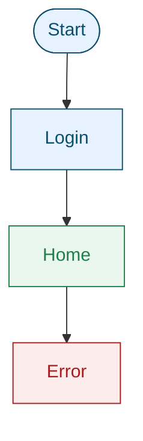

# Command: render-navigation-mermaid

Generate a navigation map diagram from `02a_navigation_map.md` using Mermaid.

## Inputs

- `02a_navigation_map.md`

## Output

- `02a_navigation_map.mmd`

## Notes

- Keep the diagram simple and readable.
- Use a consistent node style for screens.
- Show main flows and conditional branches.
- Use Mermaid classes with color styles that meet WCAG contrast.
- Prefer solid fills with high-contrast text.

## Mermaid example

